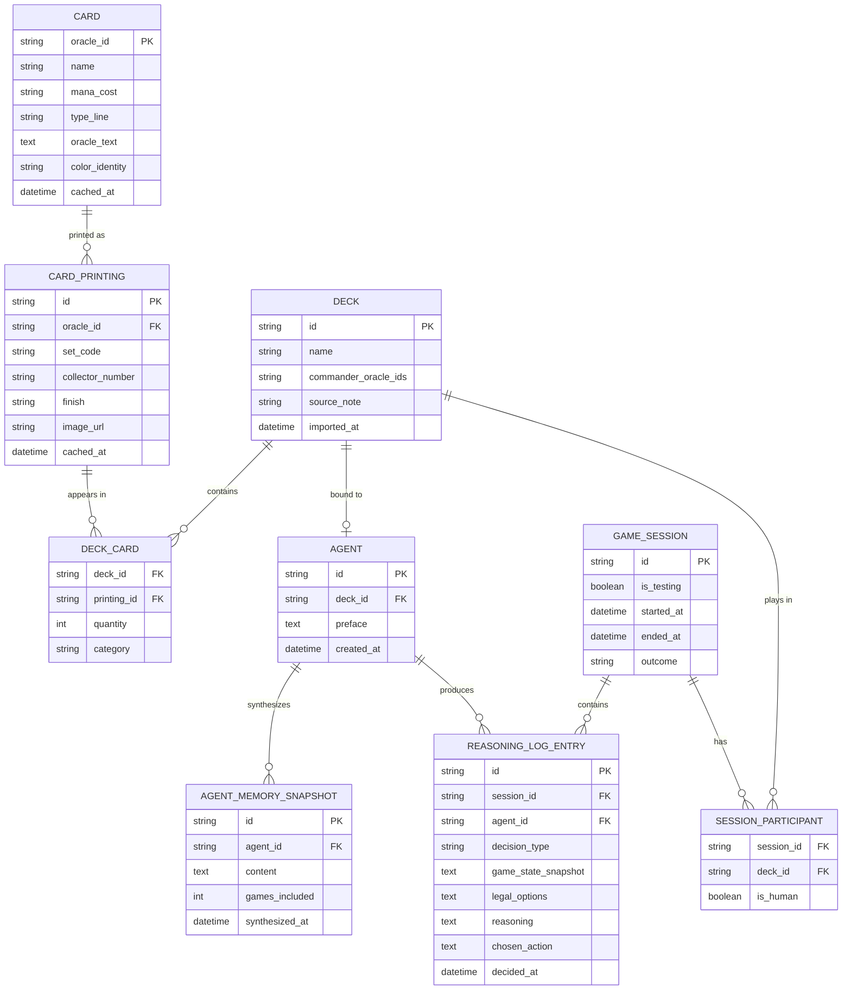

# Data Model

Covers the persisted entities implied by ADR 0003 (card cache), ADR 0008
(deck import), ADR 0006 (reasoning log), and ADR 0007 (agent
identity/memory) — the pieces that don't exist yet but that M3 onward
needs. Living doc, not a decision record — expect this to be revised as
the agent decision loop gets designed and as real implementation
surfaces things this got wrong.

## Entity-relationship overview



## Notes per entity

**Card / CardPrinting / DeckCard** *(ADR 0003 + ADR 0008, needed at
M3–M4)* — this is the entity that changed shape based on a real Moxfield
export Lucas provided: card identity and printing identity split into
two tables, because Lucas explicitly wants to track which specific art
each card uses, not just which card. `Card.oracle_id` is Scryfall's
oracle-level ID — stable across every printing of a card, and what
rules data (oracle text, mana cost, type line) actually lives on, since
those don't vary by printing. `CardPrinting.id` is Scryfall's
printing-level ID — one row per (set, collector_number), carrying
`image_url` and `finish` (nonfoil/foil/etched), which do vary by
printing. `DeckCard` references a `printing_id`, not an `oracle_id`
directly, because that's literally what the export contains: Lucas's
real list has five separate Forest lines, each a different
set/collector-number/finish combination, each its own row. Resolution
is a single batched call — Scryfall's `/cards/collection` endpoint
accepts `{set, collector_number}` as an identifier shape directly, so
the parser's output (name, set, collector number, finish, quantity per
line) maps onto that call with no intermediate translation.
`DeckCard.category` still only populates from a CSV export, not the
plain-text default — noted in ADR 0008. `commander_oracle_ids` on Deck
stays oracle-level, not printing-level: which cards are commanders is a
rules fact, not an art choice. `Deck.source_note` is inert, optional
text (e.g. "exported from moxfield.com/decks/abc123 on 2026-08-19") for
Lucas's own reference — never a lookup key or live reference anywhere in
the system, per ADR 0008.

**Agent** *(needed once a deck gets a preface — around M5–M6)* — `Deck
||--o| Agent`: zero-or-one, deliberately, so a deck can exist
import-only before Lucas has written its preface. `preface` is a plain
text column, not its own table — it's hand-edited occasionally, not
something needing row-level history. If that changes later (there's a
real case for wanting to see how your read on a deck evolved), it's a
cheap migration, not a redesign.

**AgentMemorySnapshot** *(ADR 0007 layer 3, needed at M8)* — append-only
on purpose, not a single mutable field. "Current" memory is just the
latest row by `synthesized_at`; keeping prior snapshots means the
agent's self-understanding has a visible history instead of being
silently overwritten each refresh, and gives a free rollback if a
synthesis pass goes badly. `games_included` is a count for now; a real
FK array to specific `GameSession` rows is more traceable and worth
doing once synthesis cadence (still open per ADR 0007) is actually
decided.

**GameSession / SessionParticipant** *(ADR 0006, needed at M6)* —
`SessionParticipant` is a join table rather than fixed `human_deck_id` /
`agent_deck_id` columns on `GameSession`, specifically so Phase 2's pod
(NFR-6, more than two participants) doesn't force a schema change later
— it's additive, not a migration.

**ReasoningLogEntry** *(ADR 0006, needed at M6)* — one row per decision
point, which is exactly the shape of the query-per-decision pattern from
this conversation: `legal_options` and `game_state_snapshot` are what
went into a call, `reasoning` and `chosen_action` are what came out.
This table is the literal raw material ADR 0007's synthesis reads from,
so its shape now determines how good that synthesis can be later —
worth getting the fields right even though the surrounding "how does
state actually serialize" design isn't settled yet.

## Deliberately not modeled

- **Decklist self-assessment** (ADR 0007 layer 2) isn't a table. It's
  cheaply re-derivable from `Deck` + `DeckCard` + `Card` any time it's
  needed, so persisting it just creates a cache-invalidation problem
  with no real upside. Worth revisiting only if it turns out to be
  slower to compute than expected.
- **Tag/synergy data** (EDHREC, Scryfall oracle tags, Commander
  Spellbook combos) isn't modeled here. EDHREC has no official API — the
  community tools that pull from it hit the same kind of undocumented
  JSON endpoints ADR 0008 just moved KotPod away from for Moxfield.
  Scryfall's own oracle tags (`otag:`/`function:`, e.g. `win-condition`)
  and Commander Spellbook's public `find-my-combos` endpoint are both
  meaningfully better-fitting options — first-party or documented-public
  respectively, unlike EDHREC. If oracle tags do get pulled in: Scryfall
  ships them as a daily bulk file with no server-side filter, so
  ingestion means downloading the full file, keeping only rows whose
  `oracle_id` is already in the local `Card` table, and discarding the
  rest — persisted footprint stays proportional to the actual card pool,
  same as everything else cached. Still a real decision either way, not
  something to fold in by default: worth its own ADR once actually
  wanted for ADR 0007's self-assessment layer, probably around M8.
- **`game_state_snapshot`'s exact shape** (JSON, presumably) is left
  open — same deferral ADR 0006 already made for log storage in general.
  It depends on the agent decision loop doc this data model is a
  companion to, not yet written.

## Storage

SQLite via SQLDelight per ADR 0003, for all of the above — one local
database, not a separate store per entity cluster. Roughly:

```sql
CREATE TABLE card (
    oracle_id TEXT PRIMARY KEY,
    name TEXT NOT NULL,
    mana_cost TEXT,
    type_line TEXT NOT NULL,
    oracle_text TEXT,
    color_identity TEXT,
    cached_at INTEGER NOT NULL
);

CREATE TABLE card_printing (
    id TEXT PRIMARY KEY,
    oracle_id TEXT NOT NULL REFERENCES card(oracle_id),
    set_code TEXT NOT NULL,
    collector_number TEXT NOT NULL,
    finish TEXT NOT NULL,
    image_url TEXT,
    cached_at INTEGER NOT NULL
);
```

illustrative, not final — the point is that everything above maps
directly to `.sq` files without any real translation work, not that
this exact DDL is what gets written.

## Milestone mapping

| Entities | First needed |
|---|---|
| Card, CardPrinting, Deck, DeckCard | M3 (import) / M4 (card cache) |
| Agent (id, deck_id, preface) | Whenever a preface gets written — M5/M6 in practice |
| GameSession, SessionParticipant, ReasoningLogEntry | M6 |
| AgentMemorySnapshot | M8 |
